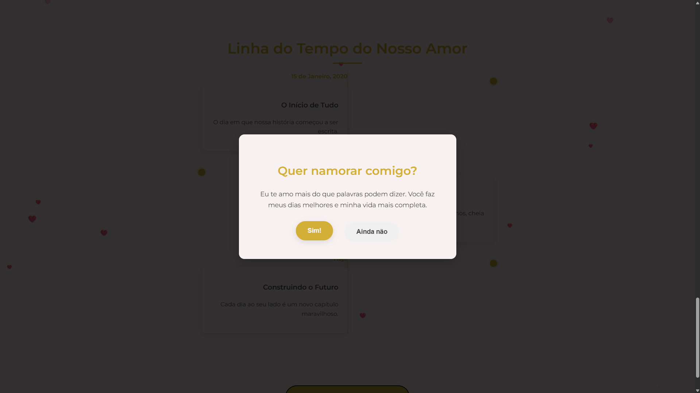

# 💌 Site de Declaração Romântica

Este é um projeto front-end completo de um site temático, criado para praticar e demonstrar habilidades avançadas de HTML5, CSS3 e JavaScript (ES6+).

## 📸 Prévia do Site

Aqui estão algumas imagens do site em funcionamento, destacando o design e as principais seções:

### Seção Inicial e Contador

### Galeria de Fotos e Minhas palavras

###  Player de Música e Linha do tempo

### Pedido Interativo

## ✨ Funcionalidades (Features)

Este não é apenas um site estático. Ele utiliza JavaScript para criar uma experiência rica, dinâmica e interativa, separando o conteúdo da lógica de programação.

* **Design Elegante e Responsivo:** Interface com fontes customizadas (Google Fonts) e uma paleta de cores profissional. O layout se adapta a telas de desktop e dispositivos móveis (`@media queries`).
* **Carregamento Dinâmico de Dados (JSON):** Todo o conteúdo de texto e imagem (Galeria, Linha do Tempo e Cartas) é carregado dinamicamente de um arquivo externo `dados.json` usando a API `fetch()` do JavaScript.
* **Contador de Relacionamento:** Um contador em tempo real que exibe anos, meses, dias, horas, minutos e segundos de relacionamento.
* **Galeria de Fotos Dinâmica:** A galeria é construída pelo JS e possui um efeito de *hover* polido com brilho dourado e transições suaves.
* **Linha do Tempo de Memórias:** Uma linha do tempo vertical estilizada com CSS (`::before`) e preenchida dinamicamente.
* **Player de Música Customizado:** O player de áudio `<audio>` padrão do navegador foi substituído por um botão "Play/Pause" totalmente estilizado com CSS, controlado por JavaScript.
* **Pedido Interativo (Popup):** Um pop-up modal para o pedido de namoro.
* **O Botão Fugitivo:** O botão "Não" foge do cursor do mouse, criando uma interação divertida que "força" o usuário a escolher o "Sim!".
* **Efeitos Visuais:**
    * **Animação de Carregamento:** A página possui um *fade-in* suave ao ser carregada.
    * **Corações Flutuantes:** Animação de corações em CSS que sobem ao fundo.
    * **Confetes:** Ao clicar em "Sim!", uma chuva de confetes (criados com JS) cai na tela.
* **Música de Celebração:** Toca um arquivo de música local (`musica.mp3`) ao aceitar o pedido, em vez de depender de links externos.

## 🛠️ Tecnologias Utilizadas

* **HTML5** (Semântico)
* **CSS3** (Variáveis, Animações `@keyframes`, Flexbox, Grid, Media Queries)
* **JavaScript (ES6+)**
    * Manipulação do DOM
    * Event Listeners
    * `fetch()` API para consumo de JSON
    * `new Audio()` para controle de áudio

---

## 📜 Licença e Copyright

Todo o código, design e layouts deste repositório são de minha autoria e estão protegidos por direitos autorais.
Este projeto é exclusivamente para fins de portfólio.
Não é permitida a cópia, distribuição ou modificação do código para uso em outros projetos, pessoais ou comerciais, sem minha permissão explícita. Se você gostou do que viu, sinta-se à vontade para se inspirar, mas crie o seu próprio!

© 2025 Karine Silva. Todos os direitos reservados.